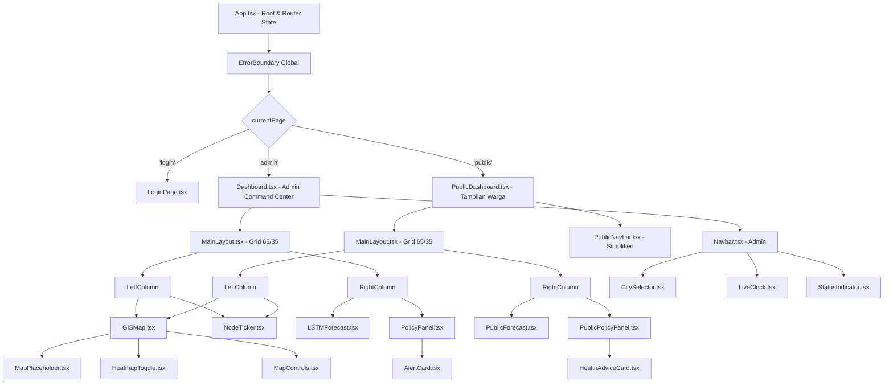
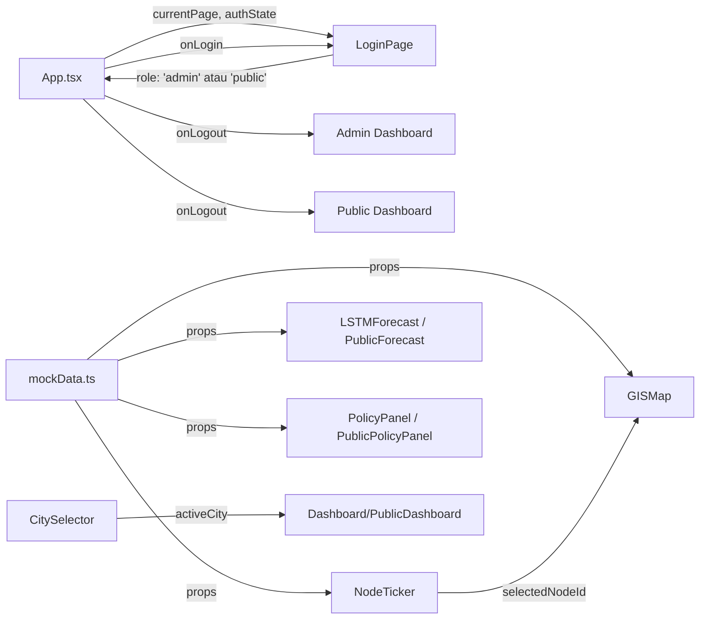

# Dokumen Desain Teknis: AirGuard Dashboard

## Ikhtisar

AirGuard Dashboard adalah antarmuka web berbasis React yang kini mendukung **sistem dual-view** dengan autentikasi berbasis peran. Sistem ini terdiri dari tiga halaman utama:

1. **Login_Page** — Halaman awal dengan formulir login mock (kredensial hardcoded).
2. **Admin_Dashboard** — "Command Center" lengkap untuk operator kota (tidak berubah dari desain sebelumnya, ditambah tombol Logout).
3. **Public_Dashboard** — Tampilan ramah warga yang menampilkan semua fitur yang sama dengan bahasa Bahasa Indonesia yang lebih sederhana dan saran kesehatan sebagai pengganti rekomendasi kebijakan teknis.

Routing antar halaman menggunakan **React state** (tanpa `react-router-dom`, karena library tersebut tidak tersedia di proyek ini).

### Tujuan Desain

- Memberikan visibilitas penuh kondisi kualitas udara kota kepada operator dalam satu layar
- Menyediakan informasi kualitas udara yang mudah dipahami oleh warga umum
- Mendukung pengambilan keputusan cepat melalui visualisasi data yang jelas dan rekomendasi otomatis
- Memastikan aksesibilitas (WCAG AA) dan performa UI yang baik
- Membangun arsitektur komponen modular yang siap diintegrasikan dengan API nyata

### Batasan Teknis

- **Framework**: React (dengan TypeScript)
- **Styling**: Tailwind CSS
- **Ikon**: Lucide React
- **Visualisasi Data**: Recharts
- **Peta**: Placeholder dengan dukungan Mapbox GL / Leaflet (opsional)
- **Tema**: Dark "Command Center" dengan efek glassmorphism
- **Routing**: React state-based (tidak menggunakan `react-router-dom`)
- **Autentikasi**: Mock credentials hardcoded (tanpa backend)

---

## Arsitektur

### Gambaran Umum Arsitektur

Sistem menggunakan **React state-based routing** di level `App.tsx`. State `currentPage` menentukan komponen mana yang dirender. `AuthContext` (atau state yang di-lift ke `App.tsx`) menyimpan informasi pengguna yang sedang login.



### Aliran Data



### Manajemen State

State dikelola menggunakan React hooks (`useState`, `useEffect`) di level komponen yang sesuai:

| State | Lokasi | Deskripsi |
|---|---|---|
| `currentPage` | `App.tsx` | Halaman aktif: `'login'`, `'admin'`, atau `'public'` |
| `authState` | `App.tsx` | `{ role: UserRole, username: string } \| null` |
| `activeCity` | `Dashboard.tsx` / `PublicDashboard.tsx` | Kota yang sedang dipantau |
| `selectedNodeId` | `Dashboard.tsx` / `PublicDashboard.tsx` | Node IoT yang sedang dipilih |
| `isHeatmapActive` | `GISMap.tsx` | Status toggle heatmap layer |
| `currentTime` | `LiveClock.tsx` | Waktu live yang diperbarui setiap detik |
| `isLoading` | Per komponen data | Status loading data dari API |
| `error` | Per komponen data | Status error pengambilan data |
| `loginError` | `LoginPage.tsx` | Pesan error login jika kredensial salah |

---

## Komponen dan Antarmuka

### Hierarki Komponen

```
src/
├── api/
│   ├── apiClient.ts
│   ├── nodeService.ts
│   ├── forecastService.ts
│   └── policyService.ts
├── components/
│   ├── Auth/
│   │   └── LoginPage.tsx           # Formulir login dengan mock auth
│   ├── Navbar/
│   │   ├── Navbar.tsx              # Admin navbar (dengan Export Report & Status Indicators)
│   │   ├── PublicNavbar.tsx        # Public navbar (hanya City Selector, Clock, Logout)
│   │   ├── CitySelector.tsx
│   │   ├── LiveClock.tsx
│   │   └── StatusIndicator.tsx
│   ├── GISMap/
│   │   ├── GISMap.tsx
│   │   ├── MapPlaceholder.tsx
│   │   ├── NodePin.tsx
│   │   ├── HeatmapToggle.tsx
│   │   └── MapControls.tsx
│   ├── NodeTicker/
│   │   ├── NodeTicker.tsx
│   │   └── NodeCard.tsx
│   ├── LSTMForecast/
│   │   ├── LSTMForecast.tsx        # Admin version (judul teknis)
│   │   ├── PublicForecast.tsx      # Public version (judul Bahasa Indonesia)
│   │   └── ForecastChart.tsx       # Shared chart component
│   ├── PolicyPanel/
│   │   ├── PolicyPanel.tsx         # Admin version (rekomendasi teknis)
│   │   ├── PublicPolicyPanel.tsx   # Public version (saran kesehatan)
│   │   ├── AlertCard.tsx           # Admin alert card
│   │   └── HealthAdviceCard.tsx    # Public health advice card
│   ├── Dashboard/
│   │   ├── Dashboard.tsx           # Admin Command Center
│   │   ├── PublicDashboard.tsx     # Public/Masyarakat view
│   │   └── MainLayout.tsx          # Shared 65/35 grid layout
│   └── shared/
│       ├── GlassCard.tsx
│       ├── SkeletonLoader.tsx
│       ├── Toast.tsx
│       └── ErrorBoundary.tsx
├── data/
│   └── mockData.ts                 # + PUBLIC_POLICY_ALERTS (saran kesehatan)
├── types/
│   └── index.ts                    # + UserRole, AuthState
├── utils/
│   ├── aqiUtils.ts                 # + getAQIPublicLabel()
│   └── authUtils.ts                # validateCredentials()
└── App.tsx                         # Mengelola currentPage & authState
```

### Antarmuka Komponen Utama

#### `App.tsx` (diperbarui)
```typescript
// State di App.tsx
type AppPage = 'login' | 'admin' | 'public';

const [currentPage, setCurrentPage] = useState<AppPage>('login');
const [authState, setAuthState] = useState<AuthState | null>(null);

const handleLogin = (role: UserRole, username: string) => {
  setAuthState({ role, username });
  setCurrentPage(role === 'admin' ? 'admin' : 'public');
};

const handleLogout = () => {
  setAuthState(null);
  setCurrentPage('login');
};
```

#### `LoginPage`
```typescript
interface LoginPageProps {
  onLogin: (role: UserRole, username: string) => void;
}
```

#### `Navbar` (Admin — tidak berubah, ditambah onLogout)
```typescript
interface NavbarProps {
  activeCity: string;
  onCityChange: (city: string) => void;
  onExportReport: () => void;
  onLogout: () => void;
}
```

#### `PublicNavbar`
```typescript
interface PublicNavbarProps {
  activeCity: string;
  onCityChange: (city: string) => void;
  onLogout: () => void;
}
```

#### `GISMap` (tidak berubah)
```typescript
interface GISMapProps {
  nodes: IoTNode[];
  selectedNodeId: string | null;
  onNodeSelect: (nodeId: string) => void;
  activeCity: string;
}
```

#### `NodeTicker` (tidak berubah)
```typescript
interface NodeTickerProps {
  nodes: IoTNode[];
  selectedNodeId: string | null;
  onNodeSelect: (nodeId: string) => void;
}
```

#### `LSTMForecast` (tidak berubah)
```typescript
interface LSTMForecastProps {
  forecastData: ForecastDataPoint[];
  isLoading: boolean;
  error: string | null;
}
```

#### `PublicForecast`
```typescript
interface PublicForecastProps {
  forecastData: ForecastDataPoint[];
  isLoading: boolean;
  error: string | null;
}
// Sama dengan LSTMForecast tetapi dengan judul dan label Bahasa Indonesia
```

#### `PolicyPanel` (tidak berubah)
```typescript
interface PolicyPanelProps {
  alerts: AlertCard[];
  isLoading: boolean;
}
```

#### `PublicPolicyPanel`
```typescript
interface PublicPolicyPanelProps {
  advices: PublicHealthAdvice[];
  isLoading: boolean;
}
```

#### `HealthAdviceCard`
```typescript
interface HealthAdviceCardProps {
  advice: PublicHealthAdvice;
}
```

#### `Dashboard` (Admin — tidak berubah, ditambah onLogout)
```typescript
interface DashboardProps {
  onLogout: () => void;
}
```

#### `PublicDashboard`
```typescript
interface PublicDashboardProps {
  onLogout: () => void;
}
```

---

## Model Data

### Tipe Data TypeScript (diperbarui)

```typescript
// types/index.ts

export type AQILevel = 'good' | 'moderate' | 'unhealthy';
export type NodeStatus = 'Active' | 'Warning' | 'Offline';
export type AlertSeverity = 'Critical' | 'Warning' | 'Insight';

// BARU: Tipe untuk sistem autentikasi
export type UserRole = 'admin' | 'public';

export interface AuthState {
  role: UserRole;
  username: string;
}

// BARU: Tipe untuk saran kesehatan publik
export interface PublicHealthAdvice {
  id: string;
  severity: AlertSeverity;   // Digunakan untuk warna aksen (sama dengan AlertCard)
  message: string;           // Teks dalam Bahasa Indonesia yang ramah warga
  timestamp: string;
  location?: string | null;
}

export interface IoTNode {
  id: string;
  name: string;
  coordinates: {
    lat: number;
    lng: number;
  };
  aqi: number;
  pm25: number;
  status: NodeStatus;
  lastUpdated: string;
}

export interface ForecastDataPoint {
  hour: string;       // Format: "HH:00" (e.g., "14:00")
  aqi: number;
  timestamp: string;  // ISO 8601
}

export interface AlertCard {
  id: string;
  severity: AlertSeverity;
  message: string;
  timestamp: string;
  location?: string | null;
}

export interface CityConfig {
  id: string;
  name: string;
  coordinates: {
    lat: number;
    lng: number;
  };
}
```

### Mock Credentials (authUtils.ts)

```typescript
// utils/authUtils.ts

export const MOCK_CREDENTIALS: Record<string, { password: string; role: UserRole }> = {
  admin: { password: 'admin123', role: 'admin' },
  user:  { password: 'user123',  role: 'public' },
};

export function validateCredentials(
  username: string,
  password: string
): UserRole | null {
  const entry = MOCK_CREDENTIALS[username];
  if (entry && entry.password === password) {
    return entry.role;
  }
  return null;
}
```

### Data Dummy Publik (mockData.ts — tambahan)

```typescript
// data/mockData.ts — tambahan konstanta baru

export const PUBLIC_HEALTH_ADVICES: PublicHealthAdvice[] = [
  {
    id: 'advice-001',
    severity: 'Critical',
    message: '⚠️ Kualitas udara sangat buruk di Persimpangan Tangerang Selatan sekitar pukul 17:00. Hindari aktivitas luar ruangan dan gunakan masker jika harus keluar.',
    timestamp: '2025-01-01T10:00:00Z',
    location: 'Tangerang Selatan',
  },
  {
    id: 'advice-002',
    severity: 'Warning',
    message: '😷 Konsentrasi PM2.5 tinggi di sekitar area sekolah. Batasi aktivitas fisik di luar ruangan untuk anak-anak.',
    timestamp: '2025-01-01T10:00:00Z',
    location: 'Area Sekolah',
  },
  {
    id: 'advice-003',
    severity: 'Insight',
    message: '✅ Kualitas udara diperkirakan baik besok pagi. Waktu yang tepat untuk berolahraga di luar ruangan.',
    timestamp: '2025-01-01T10:00:00Z',
    location: null,
  },
];
```

### Logika Klasifikasi AQI (aqiUtils.ts — tambahan)

```typescript
// utils/aqiUtils.ts — fungsi baru untuk tampilan publik

export function getAQIPublicLabel(aqi: number): string {
  if (aqi <= 50) return 'Udara Baik 🟢';
  if (aqi <= 100) return 'Sedang 🟡';
  return 'Tidak Sehat 🔴';
}

export function getNodeStatusPublicLabel(status: NodeStatus): string {
  switch (status) {
    case 'Active':  return 'Aktif';
    case 'Warning': return 'Peringatan';
    case 'Offline': return 'Tidak Aktif';
  }
}
```

---

## Sistem Desain

### Palet Warna

| Token | Nilai Hex | Penggunaan |
|---|---|---|
| `bg-slate-900` | `#0f172a` | Latar belakang utama (semua halaman) |
| `bg-slate-800/60` | `#1e293b` + 60% opacity | Kartu glassmorphism |
| `emerald-400` | `#34d399` | Status baik, AQI ≤ 50 |
| `amber-400` | `#fbbf24` | Peringatan, AQI 51–100 |
| `rose-400` | `#fb7185` | Kritis, AQI > 100 |
| `white` | `#ffffff` | Teks utama |
| `slate-400` | `#94a3b8` | Teks sekunder |

### Gaya Glassmorphism

Semua kartu komponen menggunakan kelas Tailwind berikut:

```css
/* GlassCard base style */
bg-slate-800/60 backdrop-blur-md border border-slate-700/50 rounded-xl shadow-lg
```

### Tipografi

| Elemen | Kelas Tailwind |
|---|---|
| Judul halaman | `text-2xl font-bold text-white` |
| Judul kartu | `text-lg font-semibold text-white` |
| Teks body | `text-sm text-slate-300` |
| Label kecil | `text-xs text-slate-400` |

---

## Properti Kebenaran

*Sebuah properti adalah karakteristik atau perilaku yang harus berlaku di seluruh eksekusi sistem yang valid — pada dasarnya, pernyataan formal tentang apa yang seharusnya dilakukan sistem. Properti berfungsi sebagai jembatan antara spesifikasi yang dapat dibaca manusia dan jaminan kebenaran yang dapat diverifikasi mesin.*

### Properti 1: Klasifikasi Warna AQI Konsisten

*Untuk setiap* nilai AQI yang valid, fungsi `getAQIColor` harus mengembalikan warna yang tepat: emerald untuk AQI ≤ 50, amber untuk AQI 51–100, dan rose untuk AQI > 100. Properti ini harus berlaku untuk semua nilai integer non-negatif.

**Memvalidasi: Persyaratan 3.3, 3.4, 3.5**

---

### Properti 2: Klasifikasi Warna Status Node Konsisten

*Untuk setiap* nilai status node yang valid (`Active`, `Warning`, `Offline`), fungsi `getStatusColor` harus mengembalikan warna yang tepat: emerald untuk Active, amber untuk Warning, dan rose untuk Offline.

**Memvalidasi: Persyaratan 4.2**

---

### Properti 3: Klasifikasi Warna Severity Alert Konsisten

*Untuk setiap* nilai severity alert yang valid (`Critical`, `Warning`, `Insight`), fungsi `getSeverityColor` harus mengembalikan warna yang tepat: rose untuk Critical, amber untuk Warning, dan emerald untuk Insight.

**Memvalidasi: Persyaratan 6.3, 6.4, 6.5**

---

### Properti 4: Rendering Alert Card Sesuai Data

*Untuk setiap* array `AlertCard[]` yang diberikan ke `PolicyPanel`, jumlah `AlertCard` yang dirender harus sama persis dengan panjang array tersebut, dan setiap kartu harus menampilkan severity, message, dan timestamp yang sesuai dengan data sumbernya.

**Memvalidasi: Persyaratan 6.2**

---

### Properti 5: Rendering Node Card Sesuai Data

*Untuk setiap* array `IoTNode[]` yang diberikan ke `NodeTicker`, setiap kartu yang dirender harus menampilkan Node ID, nilai PM2.5, dan status operasional yang sesuai dengan data sumbernya.

**Memvalidasi: Persyaratan 4.1**

---

### Properti 6: Tooltip Forecast Menampilkan Data yang Benar

*Untuk setiap* titik data dalam array `ForecastDataPoint[]`, ketika pengguna mengarahkan kursor ke titik tersebut pada grafik, tooltip yang ditampilkan harus memuat nilai AQI dan waktu yang persis sama dengan data sumber titik tersebut.

**Memvalidasi: Persyaratan 5.7**

---

### Properti 7: Pemilihan Kota Memperbarui Konteks Aktif

*Untuk setiap* kota dalam daftar `CITIES`, ketika pengguna memilih kota tersebut melalui `CitySelector`, nilai `activeCity` di state Dashboard harus diperbarui menjadi ID kota yang dipilih.

**Memvalidasi: Persyaratan 1.4**

---

### Properti 8: Klik Node Ticker Memusatkan Peta

*Untuk setiap* node dalam `NodeTicker`, ketika kartu node tersebut diklik, `selectedNodeId` di state Dashboard harus diperbarui menjadi ID node yang diklik, dan `GISMap` harus menerima `selectedNodeId` yang baru tersebut sebagai props.

**Memvalidasi: Persyaratan 8.1, 8.2**

---

### Properti 9: Skeleton Loading Ditampilkan Saat State Loading

*Untuk setiap* komponen yang memuat data (`GISMap`, `LSTMForecast`, `PolicyPanel`), ketika prop `isLoading` bernilai `true`, komponen tersebut harus merender elemen skeleton loading dan tidak merender konten data utama.

**Memvalidasi: Persyaratan 7.9**

---

### Properti 10: Elemen Interaktif Memiliki Atribut Aria-Label

*Untuk setiap* elemen interaktif yang dirender (tombol, dropdown, toggle switch), elemen tersebut harus memiliki atribut `aria-label` yang tidak kosong untuk mendukung pembaca layar.

**Memvalidasi: Persyaratan 7.5**

---

### Properti 11: Validasi Kredensial Login Konsisten

*Untuk setiap* kombinasi username dan password yang diberikan ke fungsi `validateCredentials`:
- Jika username adalah `'admin'` dan password adalah `'admin123'`, fungsi harus mengembalikan `'admin'`.
- Jika username adalah `'user'` dan password adalah `'user123'`, fungsi harus mengembalikan `'public'`.
- Untuk semua kombinasi lainnya (username atau password yang berbeda), fungsi harus mengembalikan `null`.

Properti ini harus berlaku untuk semua string input yang valid, termasuk string kosong, string dengan spasi, dan karakter khusus.

**Memvalidasi: Persyaratan 10.3, 10.4, 10.5**

---

### Properti 12: Routing Berbasis Peran Konsisten

*Untuk setiap* nilai `UserRole` yang valid (`'admin'` atau `'public'`), ketika fungsi `handleLogin` dipanggil dengan peran tersebut, `currentPage` di state `App.tsx` harus diperbarui ke nilai yang tepat: `'admin'` untuk peran `'admin'`, dan `'public'` untuk peran `'public'`. Properti ini harus berlaku tanpa memandang urutan login/logout sebelumnya.

**Memvalidasi: Persyaratan 10.3, 10.4, 10.6**

---

### Properti 13: Label AQI Publik Konsisten

*Untuk setiap* nilai AQI yang valid (integer non-negatif), fungsi `getAQIPublicLabel` harus mengembalikan label yang tepat: "Udara Baik 🟢" untuk AQI ≤ 50, "Sedang 🟡" untuk AQI 51–100, dan "Tidak Sehat 🔴" untuk AQI > 100. Properti ini harus berlaku untuk semua nilai integer non-negatif, konsisten dengan klasifikasi `getAQIColor`.

**Memvalidasi: Persyaratan 12.1**

---

### Properti 14: Logout Mengembalikan ke Login Page

*Untuk setiap* state autentikasi yang valid (baik `role: 'admin'` maupun `role: 'public'`), ketika fungsi `handleLogout` dipanggil, `authState` harus menjadi `null` dan `currentPage` harus menjadi `'login'`. Properti ini harus berlaku tanpa memandang halaman mana yang sedang aktif sebelum logout.

**Memvalidasi: Persyaratan 10.8**

---

## Penanganan Error

### Error Boundary Global

`ErrorBoundary` global membungkus seluruh konten di `App.tsx`. Jika satu komponen anak melempar error, komponen lain tetap berfungsi normal.

### Strategi Penanganan Error Per Komponen

| Komponen | Kondisi Error | Tampilan Fallback |
|---|---|---|
| `LSTMForecast` | Gagal fetch data | "Gagal memuat prediksi AI. Silakan coba lagi." |
| `PublicForecast` | Gagal fetch data | "Gagal memuat data. Silakan coba lagi nanti." |
| `PolicyPanel` | Array data kosong | "Kualitas udara saat ini stabil. Tidak ada rekomendasi kebijakan darurat." |
| `PublicPolicyPanel` | Array data kosong | "Udara hari ini dalam kondisi baik. Tidak ada saran khusus saat ini. 🌿" |
| `GISMap` | Library peta tidak tersedia | Placeholder visual fungsional dengan data node dummy tetap terlihat |
| `LoginPage` | Kredensial salah | "Username atau password salah. Silakan coba lagi." (inline, tidak navigasi) |
| `Navbar` | Gagal merender | Dashboard tetap menampilkan konten utama (Error Boundary level Navbar) |

---

## Strategi Pengujian

### Pendekatan Pengujian Ganda

Dashboard ini menggunakan dua lapisan pengujian yang saling melengkapi:

1. **Unit Test (Example-Based)**: Memverifikasi perilaku spesifik dengan contoh konkret.
2. **Property-Based Test (PBT)**: Memverifikasi properti universal yang harus berlaku untuk semua input valid.

### Library yang Digunakan

| Tujuan | Library |
|---|---|
| Unit & Integration Test | Vitest + React Testing Library |
| Property-Based Test | `fast-check` |
| Aksesibilitas | `jest-axe` |
| Snapshot Test | Vitest built-in snapshots |

### Rencana Pengujian Per Komponen (Tambahan untuk Dual-View)

#### Unit Tests Baru

| Komponen | Skenario Uji |
|---|---|
| `LoginPage` | Render formulir, input kredensial admin → panggil onLogin dengan 'admin', input kredensial publik → panggil onLogin dengan 'public', kredensial salah → tampilkan pesan error, tidak navigasi |
| `PublicNavbar` | Render logo, render City_Selector, render tombol Logout, tidak ada tombol Export Report, tidak ada Status_Indicator |
| `PublicDashboard` | Render semua komponen (GISMap, NodeTicker, PublicForecast, PublicPolicyPanel), render PublicNavbar |
| `PublicForecast` | Render grafik dengan judul Bahasa Indonesia, render error state dengan pesan Bahasa Indonesia |
| `PublicPolicyPanel` | Render HealthAdviceCard, tampilkan empty state Bahasa Indonesia |
| `HealthAdviceCard` | Render severity, message, timestamp dengan format publik |
| `App.tsx` | Render LoginPage saat awal, render Admin_Dashboard setelah login admin, render Public_Dashboard setelah login publik, kembali ke LoginPage setelah logout |

#### Property-Based Tests Baru

| Properti | Implementasi |
|---|---|
| Properti 11 | `fc.string()` × `fc.string()` → verifikasi `validateCredentials` hanya mengembalikan role untuk kredensial yang tepat |
| Properti 12 | `fc.constantFrom('admin', 'public')` → simulasikan login, verifikasi `currentPage` diperbarui dengan benar |
| Properti 13 | `fc.integer({ min: 0, max: 500 })` → verifikasi `getAQIPublicLabel` konsisten dengan `getAQIColor` |
| Properti 14 | `fc.constantFrom('admin', 'public')` → simulasikan login lalu logout, verifikasi `currentPage` kembali ke `'login'` |

### Cakupan Pengujian Target

- **Unit Tests**: ≥ 80% cakupan baris untuk semua komponen (termasuk komponen baru)
- **Property Tests**: 100 iterasi per properti, minimum 14 properti
- **Aksesibilitas**: 0 pelanggaran axe-core pada level WCAG AA untuk semua halaman (LoginPage, Admin_Dashboard, Public_Dashboard)
